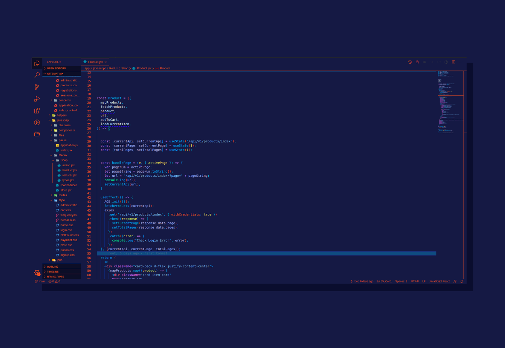

  

  

 
 
  

# Fify Theme

A **Fify Theme** For *VSCode*.  
Using *Classic Blue* and *Light Green* **Magic**.

# Preview

# Installation
1. Open *Extensions* **sidebar panel** in VS Code. **View → Extensions**  
2. Search for **Fiffy Theme** By *Chamepp*.  
3. Click **Install** to install and *reload* your editor.  
4. **Code > Preferences > Color Theme > Fify**  
5. **Enjoy !**

# Development
**Developed** With Love By **Ashkan Ebtekari**.
